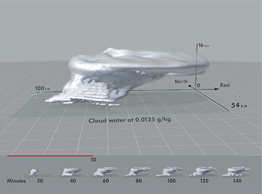

# Now

Get current weather conditions via [forecast.io](http://forecast.io).




## Setup

1. Install via [npm](https://npmjs.org).

    `npm install now-forecast`

2. Specify your [forecast.io api key](https://developer.forecast.io/) and location coordinates in `config.json`.
   
   You'll find the config file in `$(npm -g root)/now-forecast`.

```
> cat $(npm -g root)/now-forecast/config.json
{
    "key": "YOUR-FORECAST.IO-API-KEY",
    "coords": "35.2102,-85.9364",
    "location": "Sewanee, TN",
    "defaults": ["summary", "temperature", "humidity"]
}
```

... or ...

1.  Download or clone.

2. Specify your [forecast.io api key](https://developer.forecast.io/) and location coordinates in `config.json`.

3. Use `npm -g install` to install dependencies and the `now` command-line utility.


## Usage

```coffeescript
{data} = require 'now'

# callback for handling the returned JSON
summary = (d) ->  
  console.log "Currently #{d.currently.summary}"
  console.log d.daily.summary

data summary
```

This should print out something like ...

    Currently Clear
    Light rain next week; temperatures rising to 89° on Tuesday.


### CLI

    > now 
    time: 1378231463
    summary: 'Clear'
    icon: 'clear-day'
    precipIntensity: 0
    precipProbability: 0
    temperature: 82.3
    apparentTemperature: 84.07
    dewPoint: 64.92
    windSpeed: 9.07
    windBearing: 357
    cloudCover: 0.19
    humidity: 0.56
    pressure: 1005.71
    visibility: 10
    ozone: 291.68

    > now temperature humidity
    temperature: 84.24
    humidity: 0.49
